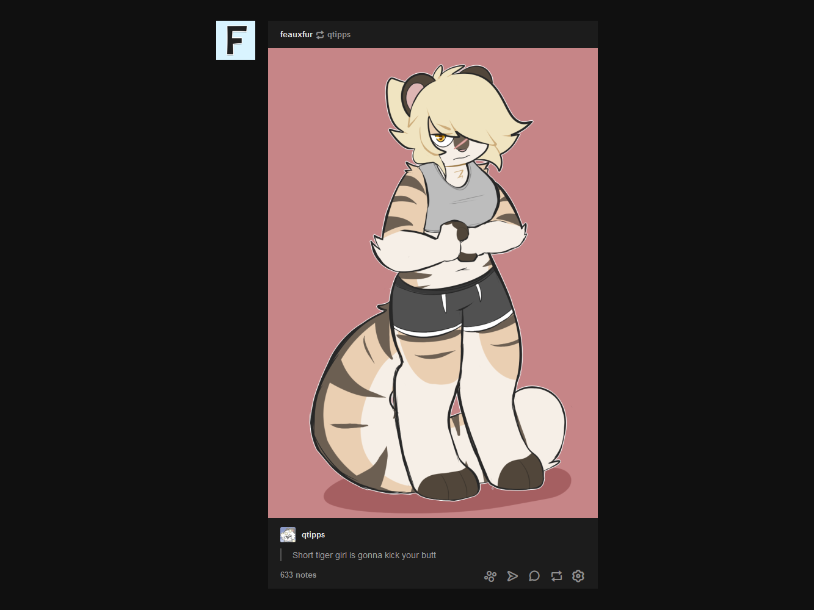

# userstyles

some of my userstyles.

## tumblr.css

only affects the dashboard.

## firefox.css

sets about:newtab and about:blank to a solid dark-gray (`#101010`, same as tumblr.css)

## mastodon.css

makes the columns take the full width of the screen, and also hides the mascot in the bottom-right.
